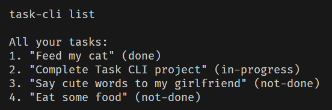

# Task Tracker CLI
***
Task-tracker is command line interface application to help people manage their tasks.



***
### Commands for task-cli:
**IMPORTANT:**

```
'*' - required argument
words 'todo' and 'not-done' is synonyms

task-cli add *[description] - Add task to your list
task-cli delete *[Task ID] - Removes task from your list
task-cli update *[Task ID] *[description] - Updates description of task

task-cli list [done/in-progress/todo] - list your tasks

task-cli mark-todo *[Task ID] - Marks your task as not done                 
task-cli mark-in-progress *[Task ID] - Marks your task as in-progress
task-cli mark-done *[Task ID] - Marks your task as done
```
This is full list of command of **task-cli** app

***

### Installing Task-Tracker

To install Task-Tracker, follow these steps:

1. Clone this project via git:

   ```shell
   git clone https://github.com/Keva1z/Task-Tracker.git
   ```

***

### Using Task-Tracker

1. move to the directory created after cloning:

   ```shell
   cd Task-Tracker
   ```

2. Run the task tracker:

   ```shell
   py task-cli.py
   ```

***

### Contributing to Task-Tracker

1. Fork this repository.
2. Create a new branch: `git checkout -b <branch_name>`
3. Make your changes and commit them: `git commit -am '<commit message>'`
4. Push you changes to the original branch: `git push origin master`
5. Create a pull request

Alternatively see the GitHub documentation on [creating a pull request](https://help.github.com/en/github/collaborating-with-issues-and-pull-requests/creating-a-pull-request)

### Project source

This project inspired from [Roadmap](https://www.roadmap.sh). Click this [link](https://roadmap.sh/projects/task-tracker) to checkout the project